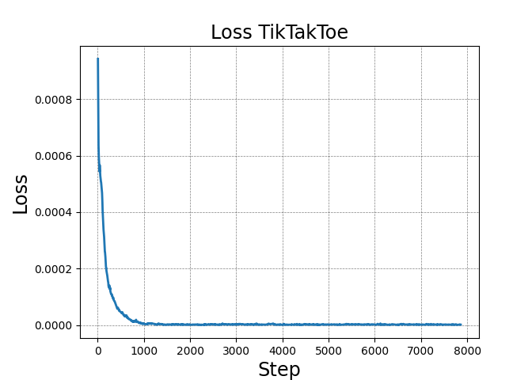

# Self-Play_DQN_Project
IANNWTF Project WS22/23
 [Eosandra Grund](https://github.com/egrund/) and [Fabian Kirsch](https://github.com/Kirschberg32/)
The project was created using Python 3.10.8. The package requirements can be found in [requirements.txt](requirements.txt). It is our final project for the course 'Implementing Artificial Neural Networks in Tensorflow' given in the winter semester 22/23 at Osnabrück University. 

We trained DQN agents to play Tic-Tac-Toe and Connect Four using self-play. And then used them as a base for an adapting agent that creates a more balanced game and hopefully a better playing experience. The adapting agents where created by changing the action decions formula in the method action_choice of Agent. 

# Results: 
As you can see in the following plots, our agents learned well. 

Training progress of our best Tic-Tac-Toe agent in loss

Training progress of our best Tic-Tac-Toe agent in ratio of rewards.

The plots for Connect Four can be found in [here](Plots/best_agents_plots/). 

The adapting agents worked well, but not perfect yet. The following is a plot of one method for Tic-Tac-Toe. On the x-axis are different strong opponents from strong to weak and on the y-axis is the percentage for every reward. 

# Files: 
* [Dia](Dia): contains UML class diagrams for our code
* [Plots](Plots): Folder with different Plots from runs and tests
  * [best_agents_plots](Plots/best_agents_plots): contains plots from loss and ratio of rewards from the testing during training
  * [connectfour_testing](Plots/connectfour_testing): contains plots form testing DQNAgent and Adapting agents against different strong opponents for Connect Four
  * [tiktaktoe_testing](Plots/tiktaktoe_testing):contains plots form testing DQNAgent and Adapting agents against different strong opponents for Tic-Tac-Toe
* [Video](Video): contains the script, the slides and the presentation video
* [logs](logs): Log-Files created during the runs
  * [3agents_linear/20230328-212250](logs/3agents_linear/20230328-212250): training 3 agents to play tic-tac-toe using epsilon = 0.995
  * [AgentTanH/20230327-192241](logs/AgentTanH/20230327-192241): training Tic-Tac-Toe with linear activation function using epsilon = 0.998
  * [ConnectFour_linear/20230330-174353/](logs/ConnectFour_linear/20230330-174353): training Connect Four with a linear activation function and epsilon = 0.995
  * [agent_ConnectFour_tanh/20230328-094318](logs/agent_ConnectFour_tanh/20230328-094318): training Connect Four with tanh activation function (best performance for Connect Four) and epsilon = 0.995
  * [agent_linear_decay099/20230327-185908](logs/agent_linear_decay099/20230327-185908): training Tic-Tac-Toe with a linear activation function and epsilon = 0.99 (best performance for Tic-Tac-Toe)
  * [best_agent_tiktaktoe_0998/20230327-191103](logs/best_agent_tiktaktoe_0998/20230327-191103): training Tic-Tac-Toe with tanh activation function and epsilon = 0.998
* [model](model): Saved best models of different runs, for a description have a look at the logs description above
* [Report](Report): contains the finished report which was part of the project
* [selfplaydqn](selfplaydqn): Entails all Python files
  * [agentmodule](selfplaydqn/agentmodule)
    * [agent.py](selfplaydqn/agentmodule/__init__.py): contains all Agent subclasses and the Agent class
    * [buffer.py](selfplaydqn/agentmodule/__init__.py): contains the buffer class and all its functionalities
    * [model.py](selfplaydqn/agentmodule/__init__.py): contains the convolutional neural network used as Q-network
    * [testing.py](selfplaydqn/agentmodule/__init__.py): contains functions for testing the agents performance
    * [training.py](selfplaydqn/agentmodule/__init__.py): contains the training algorithm
  * [envs](selfplaydqn/envs)
    * [envwrapper2.py](selfplaydqn/envs/envwrapper2.py): The wrapper that makes self-play environments out of the envs
    * [keras_gym_env.py](selfplaydqn/envs/keras_gym_env.py): Contains Connect Four
    * [keras_gym_env_2wins.py ](selfplaydqn/envs/keras_gym_env_2wins.py ): Connect Four, but 2 horizontal wins, and only wins
    * [keras_gym_env_novertical.py](selfplaydqn/envs/keras_gym_env_novertical.py): Connect Four, but you cannot win vertically
    * [sampler.py](selfplaydqn/envs/sampler.py): The sampling algorithm as a class that remembers the opponent and all the envs to reuse them
    * [tiktaktoe_env.py](selfplaydqn/envs/tiktaktoe_env.py): Contains Tic-Tac-Toe
  * [main_testing.py](selfplaydqn/main_testing.py): test one ore default several agents performance against a random agent
  * [main_testing_adapting.py](selfplaydqn/main_testing_adapting.py): test one adapting agent (or DQNAgent) against different strong opponents
  * [main_train_best.py](selfplaydqn/main_train_best.py): trains a DQN
  * [play_vs_agent.py](selfplaydqn/play_vs_agent.py): lets you play against a trained agent
  * [play_vs_agent_adapting.py](selfplaydqn/play_vs_agent_adapting.py): lets you play against a trained agent using an adapting action decision formula
  * [play_vs_person.py](selfplaydqn/play_vs_person.py): lets you play against yourself or another person to test the environments
  * [plot_tensorboard_data.py](selfplaydqn/plot_tensorboard_data.py): plots csv data from tensorboard, either loss or reward ratio
* [text_info_runs](text_info_runs): data created by testing different agents, as well as information about hyperparameters used to train the different agents
  * [ConnectFour.txt](text_info_runs/ConnectFour.txt): contains information about hyperparameters for all Connect Four training runs
  * [best_agent_ConncetFour_comparison.txt](text_info_runs/best_agent_ConncetFour_comparison.txt): contains results of the comparison of all best Connect Four agents
  * [best_agent_comparison.txt](text_info_runs/best_agent_comparison.txt): contains results of the comparison of all best Tic-Tac-Toe agents
  * [best_model_tiktaktoe2703.txt](text_info_runs/best_model_tiktaktoe2703.txt): contains information about hyperparameters for all Tic-Tac-Toe training runs
